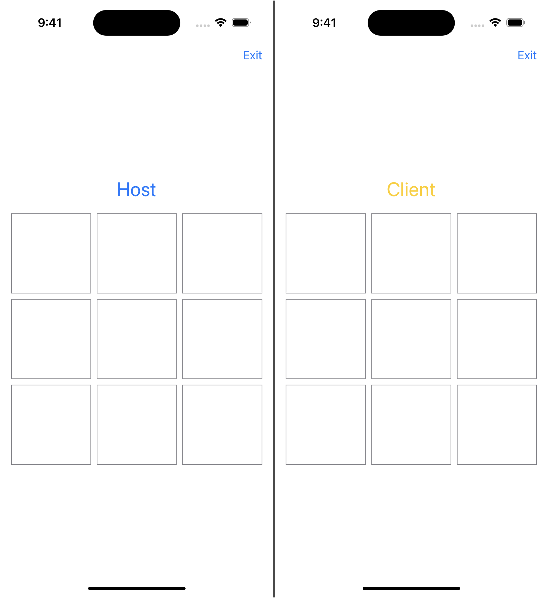
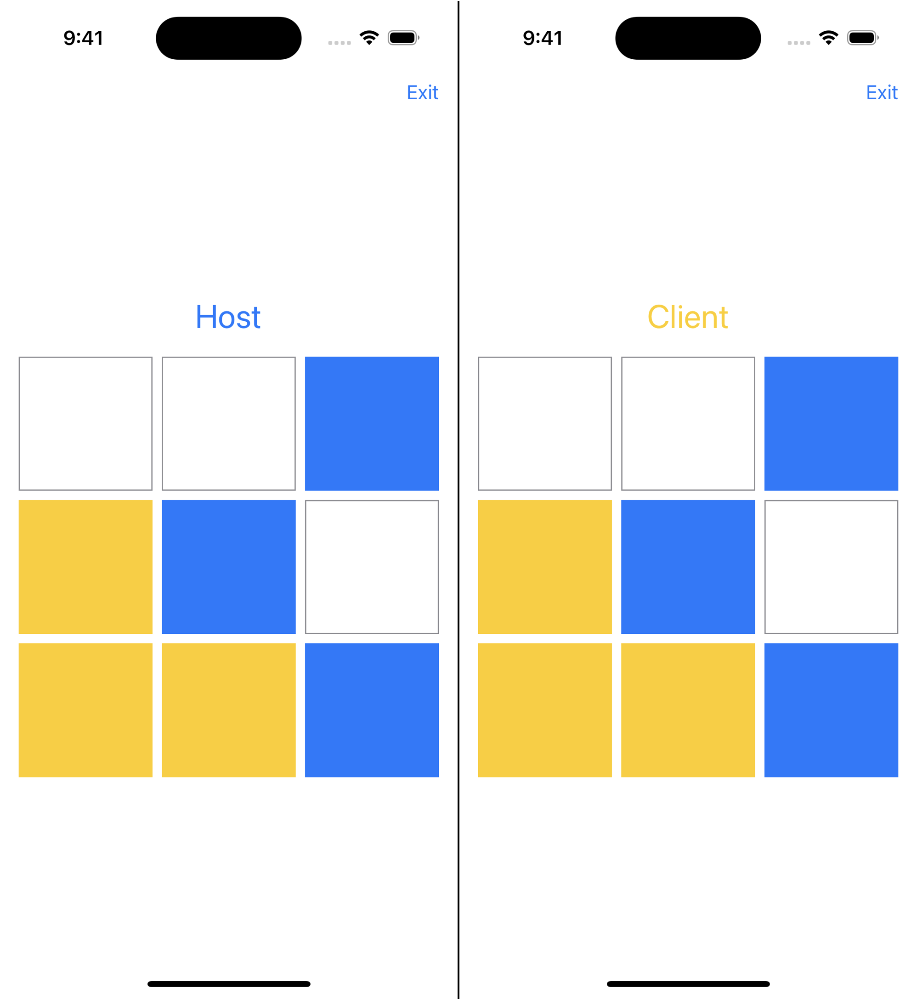

□Bonjourとネットワーク通信を通して学ぶNetwork.framework実践ガイド
https://fortee.jp/iosdc-japan-2024/proposal/38a4ff87-2cc1-4494-b8e6-63fcf506430f

　[Network.framework](https://developer.apple.com/documentation/network)は、2018年6月の「World Wide Developers Conference 2018」（以下、WWDC18）で発表されました。
このフレームワークは、iOS 12.0をはじめとしたWWDC18発表のAppleプラットフォームで使用できます。
また、visionOSもサポートしています。

　本稿ではNetwork.frameworkを活用し、NWBrowserでのネットワークサービスの検出と、NWListenerおよびNWConnectionを用いた通信について解説します。
また、Swift Concurrencyと組み合わせて、2024年段階のアプローチでサンプルコードを提供します。
Network.frameworkがサポートする範囲は膨大で、すべてを網羅はできませんが、取り組むきっかけとなる内容を扱います。

# はじめに

　本稿を読む上での注意事項を説明します。

## GitHubリポジトリ

　本稿は[yutailang0119/iosdc-2024-pamphlet](https://github.com/yutailang0119/iosdc-2024-pamphlet)でも閲覧可能です。
サンプルコードの全体は、リポジトリの`/ExampleApp.xcworkspace`を開き、参照してください。

　内容に訂正がある場合、GitHubリポジトリで訂正します。
また、質問などは[issues](https://github.com/yutailang0119/iosdc-2024-pamphlet/issues)から連絡ください。

## 開発環境

　本稿の内容は、開発環境としてmacOS Sonoma 14.5（23F79）とXcode 15.4（15F31d）を使用して動作を確認しています。
開発言語にはXcodeに付属のSwift 5.10を利用します。
サンプルコードの実行は、iOS 17.5（21F79）を対象とします。

## 権利・ライセンス

　本稿の全文、GitHubリポジトリ`/pamphlet`以下は、クリエイティブ・コモンズの[CC-BY 4.0](https://creativecommons.org/licenses/by/4.0/deed.ja)で管理します。
　サンプルコード、GitHubリポジトリ`/ExampleApp`以下は、MITライセンスで管理します。

## ローカルネットワークのプライバシー

　本稿で扱うローカルネットワークアクセスは、Info.plistでユーザーの許可が必要です。
ローカルネットワークの使用には、[NSLocalNetworkUsageDescription](https://developer.apple.com/documentation/bundleresources/information_property_list/nslocalnetworkusagedescription)に用途を記載します。
Bonjourでの検出には、[NSBonjourServices](https://developer.apple.com/documentation/bundleresources/information_property_list/nsbonjourservices)にサービスタイプを宣言します。
詳しくはWWDC20の動画[Support local network privacy in your app](https://developer.apple.com/videos/play/wwdc2020/10110/)を参照してください。

　また、iPhoneやMacのネットワーク設定によって、ローカルネットワークの通信は制限されることがあります。
一時的にFirewallの設定を見直してください。

# Network.frameworkの概観

　Network.frameworkは、データ送受信のためのネットワーク接続用フレームワークです。
[`URLSession`](https://developer.apple.com/documentation/foundation/urlsession)の内部でも使用されており、多くのアプリを支えています。

## サポートする通信プロトコル

　Network.frameworkを使用することで、TLS、TCP、UDPなどの主要な通信プロトコルに直接アクセスが可能です。
TCPは[NWProtocolTLS](https://developer.apple.com/documentation/network/nwprotocoltls)といった、プロトコルに対応するclassがそれぞれ用意されています。
iOS 13では[NWProtocolWebSocket](https://developer.apple.com/documentation/network/nwprotocolwebsocket)でWebSocket、iOS 15では[NWProtocolQUIC](https://developer.apple.com/documentation/network/nwprotocoludp)でQUICのサポートが追加されました。

　さらに[NWProtocolFramer](https://developer.apple.com/documentation/network/nwprotocolframer)を使って、独自プロトコルでの通信も実装できます。
従来のソケット通信の複雑なバイト列を扱うことなく、構造化されたメッセージの読み取りが可能です。
詳しくはWWDC19の動画[Advances in Networking, Part 2](https://developer.apple.com/videos/play/wwdc2019/713/)を参照してください。

## 通信状況のモニタリング ── NWPathMonitor

　Network.frameworkの機能の一つは、ネットワーク状況の監視です。
監視には[`NWPathMonitor`](https://developer.apple.com/documentation/network/nwpathmonitor)を使用します。
具体的な使用方法は、サンプルコードを参照してください。

　`NWPathMonitor`は、実際に通信が成功するかを正確に反映するものではないことに注意します。
ユーザーによって行われた通信の場合、常に接続を試みるべきです。
ネットワークサービスが利用可能かを推測したり、その判断をキャッシュしたりしないでください。

## Network.frameworkの登場以前

　Network.frameworkの機能は、[CFNetwork.framework](https://developer.apple.com/documentation/cfnetwork)や
[Foundation.framework](https://developer.apple.com/documentation/foundation)のNS prefixなAPIなどを駆使して、実装可能ではありました。
これらは、C言語との相互運用やポインタを意識した実装が必要で、Swiftに慣れ親しんだ開発者には難解です。
Network.frameworkの利点は、単純あ接続の確立、データ転送の最適化、組込みのセキュリティ、シームレスなモビリティ、そしてSwiftのフレームワークであることです。

# Bonjourを用いたネットワーク上サービスの検出

　ネットワークはインターネットに接続するだけではありません。
ローカルネットワーク上のほかのデバイスとやりとりすることがあります。
Appleデバイスでローカルネットワークを利用するには、Bonjour（ボンジュール）が最適です。

　Network.frameworkを使ったBonjourサービスの検出について解説します。

## Bonjour

　Bonjourは、Appleが開発したゼロ・コンフィギュレーション技術で、IPアドレスやホスト名を入力せずに接続する方法を提供します。
ビデオやオーディオのストリーミング、peer-to-peerゲーム、プリンター、カメラ、ホームデバイスとの通信の基盤となります。
たとえば、同じネットワーク上のAirPrintのプリンター自動検出やHomeKitへの接続に使用されます。

　現在ではAppleデバイスに限らず、WindowsやLinuxなどの主要プラットフォームがサポートしています。

## Network.frameworkを用いたAirPlayの検出

　Appleデバイスに囲まれた生活を送る私たちの周りには、Apple TVなどのAirPlay対応デバイスが溢れています。
Network.frameworkを使って、同じネットワーク上のAirPlayを検出してみます。

### AirPlay

　Bonjourの検出には、告知（アドバタイズ）しているサービス名を指定します。
AirPlayは、`_airplay._tcp`でTCPサービスを告知しています。
より詳しい解説は[AppleデバイスでAirPlayを使用する](https://support.apple.com/ja-jp/guide/deployment/dep9151c4ace/web)を参照してください。

### NWBrowserでのAirPlay検出

　Network.frameworkでBonjourサービスの検出は、[`NWBrowser`](https://developer.apple.com/documentation/network/nwbrowser)を使用します。
サービスタイプ`_airplay._tcp`を指定して`NWBrowser`を初期化し、[`browseResultsChangedHandler`](https://developer.apple.com/documentation/network/nwbrowser/3200395-browseresultschangedhandler)で検出結果の変化を受け取ります。
[`start(queue:)`](https://developer.apple.com/documentation/network/nwbrowser/3200402-start)で、検出を開始します。

```swift
func browse() -> AsyncStream<Set<NWBrowser.Result>> {
  AsyncStream { continuation in
    let browser = NWBrowser(
      for: .bonjour(
        type: "_airplay._tcp",
        domain: nil
      ),
      using: .tcp
    )
    browser.browseResultsChangedHandler = { results, changes in
      continuation.yield(results)
    }
    continuation.onTermination = { _ in
      browser.cancel()
    }
    browser.start(queue: .main)
  }
}
```


# Network.frameworkでのUDP送受信

　UDPでのコネクション、データの送受信を解説します。
例は`_example._udp`で接続し、パネルの状態を相互に送り合うアプリです。

## Bonjourサービスの告知（アドバタイズ） ── NWListener

　サービスの告知は、[`NWListener`](https://developer.apple.com/documentation/network/nwlistener)を使用します。
初期化した`NWListener`にサービスタイプ`_example._udp`を指定した[`NWListener.Service`](https://developer.apple.com/documentation/network/nwlistener/service)を設定します。
[`start(queue:)`](https://developer.apple.com/documentation/network/nwlistener/2998669-start)で、告知を開始します。

```swift
func host() -> AsyncThrowingStream<NWConnection, Error> {
  AsyncThrowingStream { continuation in
    do {
      let listener = try NWListener(using: .udp)
      listener.service = NWListener.Service(name: uuid, type: "_example._udp")
      continuation.onTermination = { _ in
        listener.cancel()
      }
      listener.start(queue: .main)
    } catch {
      continuation.finish(throwing: error)
    }
  }
}
```

## Bonjourサービスの検出（ディスカバー） ── NWBrowser

　`NWListener`が告知しているBonjourサービスの検出は、前述の`NWBrowser`を使用します。
サービスタイプを`_example._udp`、[`NWParameters`](https://developer.apple.com/documentation/network/nwparameters)の指定を[`.udp`](https://developer.apple.com/documentation/network/nwparameters/2998711-udp)に変更します。

```swift
let browser = NWBrowser(
  for: .bonjour(
    type: "_example._udp",
    domain: nil
  ),
  using: .udp
)
```

　`NWListener`が告知しているサービスの一覧が検出されます。


## コネクションの確立 ── NWConnection

　告知、検出がそれぞれできたので、コネクションを確立します。
Network.frameworkでは[`NWConnection`](https://developer.apple.com/documentation/network/nwconnection)を使用します。

　例ではUDPのため、TCPのようなハンドシェイクを経てコネクションが確立されるというわけではありません。

### Bonjourサービス検出側のコネクション

　Bonjourサービスを検出する側から、コネクションの確立を試みます。
検出した[`NWBrowser.Result`](https://developer.apple.com/documentation/network/nwbrowser/result)から[`NWEndpoint`](https://developer.apple.com/documentation/network/nwendpoint)を取得し、`NWConnection`を初期化します。
[`start(queue:)`](https://developer.apple.com/documentation/network/nwconnection/2998575-start)で、コネクションを確立を開始します。

```swift
let connection = NWConnection(to: result.endpoint, using: .udp)
connection.start(queue: .main)
```

　UDPの場合、[`send(content:contentContext:isComplete:completion:)`](https://developer.apple.com/documentation/network/nwconnection/3003626-send)で一度データを送信することで、`NWListener`側のコネクションも起動します。

### Bonjourサービス告知側のコネクション

　`NWListener`で告知しているサービスにコネクションが確立すると、[`newConnectionHandler`](https://developer.apple.com/documentation/network/nwlistener/2998663-newconnectionhandler)に通知されます。

```swift
func host() -> AsyncThrowingStream<NWConnection, Error> {
  AsyncThrowingStream { continuation in
    （省略）
      listener.newConnectionHandler = { connection in
        continuation.yield(connection)
      }
    （省略）
  }
}
```

　`NWListener`では、通知された`NWConnection`を使って通信を開始します。



## データの送受信

　コネクションの確立ができたので、`NWConnection`を通して双方向にデータの送受信を行います。
例は`Codable`に準拠した`ConnectionData`を`Data`に変換してやりとりします。

### データ送信の実装

　データの送信は、前述の`send(content:contentContext:isComplete:completion:)`を使います。
UDPのようなデータグラムプロトコルでは、`isComplete`はコンテンツが完全なデータグラムを表していることを示します。
この例では、常に完全なデータを送信するため、`isComplete: true`としています。

```swift
let content = try? encoder.encode(connectionData)
connection.send(
  content: content,
  contentContext: .defaultMessage,
  isComplete: true,
  completion: .contentProcessed { error in
    print(error)
  }
)
```

### データ受信の実装

　受信したデータは、[`receiveMessage(completion:)`](https://developer.apple.com/documentation/network/nwconnection/3020638-receivemessage)で取得できます。
これまで登場したハンドラと異なり、呼び出しごとに一度だけ実行されるため、複数回データを受信するには再度実行する必要があります。
この実装でも、[`AsyncThrowingStream`](https://developer.apple.com/documentation/swift/asyncthrowingstream)は便利です。

```swift
func receiveMessages() -> AsyncThrowingStream<Data, Error> {
  AsyncThrowingStream { continuation in
    func receiveMessage() {
      connection.receiveMessage { content, contentContext, isComplete, error in
        if let content {
          continuation.yield(content)
          receiveMessage()
        } else if let error {
          print(error)
          connection.cancel()
        }
      }
    }

    receiveMessage()
    connection.start(queue: .main)
  }
}
```



　簡略化しましたが、`Codable`のdecode、encodeは実行コストが高く、高頻度の通信には向きません。
また、実用にはパスコードの入力を挟むなど、コネクションの安全性も考慮する必要があるでしょう。
GitHubリポジトリにはTCPでの通信も用意したので、参照してください。

# まとめ

　Bonjourとローカルネットワーク通信の実装を通して、Network.frameworkについて解説しました。
ローカルネットワークでの通信には、[Core Bluetooth](https://developer.apple.com/documentation/corebluetooth)や[Multipeer Connectivity](https://developer.apple.com/documentation/multipeerconnectivity)もあります。
状況に合わせた選択肢を持っているとよいでしょう。

　Network.frameworkが`URLSession`の内部で使用されていると説明した通り、インターネットへの接続も実装できます。
HTTP通信を再実装してみるのも、よい題材になりそうです。
